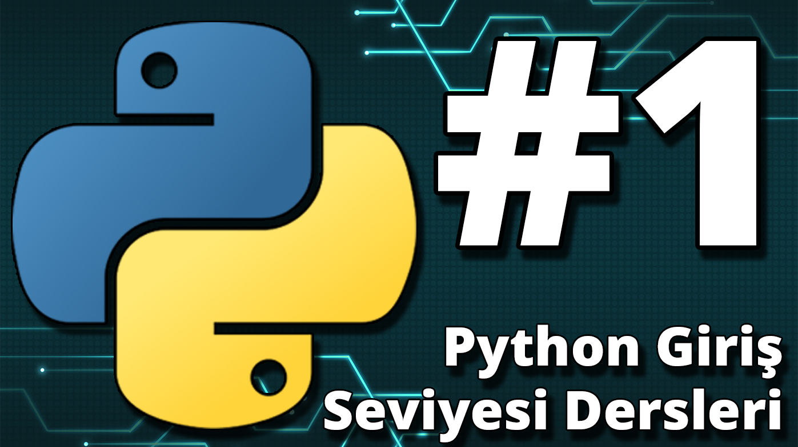
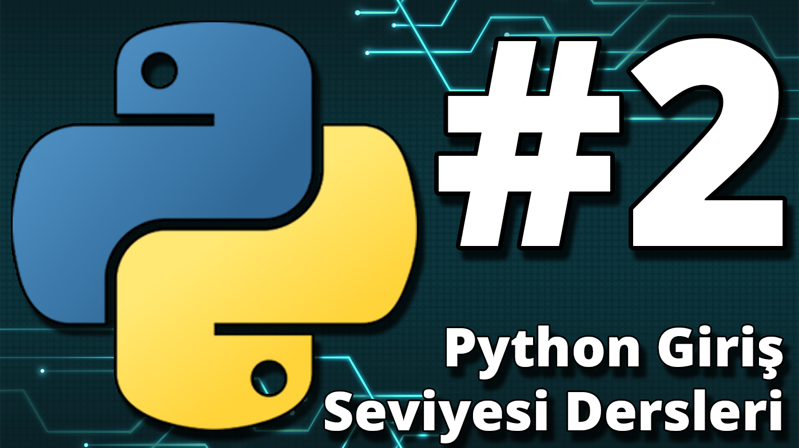
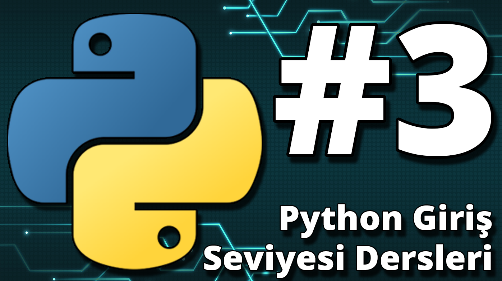

# PythonLectures
Lecture notes that I have created for our IEEE Student Community lessons

# Ders Videoları
- [Playlist](https://youtube.com/playlist?list=PLrDo0HYBrFaSBTx2tbr2Q06DT8uRxdeNu&si=_rf5hNKpfWxP21JD)
  
  - [Ders 1 ](https://www.youtube.com/watch?v=254dJSLkpMM&list=PLrDo0HYBrFaSBTx2tbr2Q06DT8uRxdeNu&index=1&pp=iAQB)

  - [Ders 2 ](https://www.youtube.com/watch?v=SG98lL-iEGI&list=PLrDo0HYBrFaSBTx2tbr2Q06DT8uRxdeNu&index=2&pp=iAQB)
  
  - [Ders 3 ](https://www.youtube.com/watch?v=mXf6ByxQfR0&list=PLrDo0HYBrFaSBTx2tbr2Q06DT8uRxdeNu&index=3&pp=iAQB)
  
